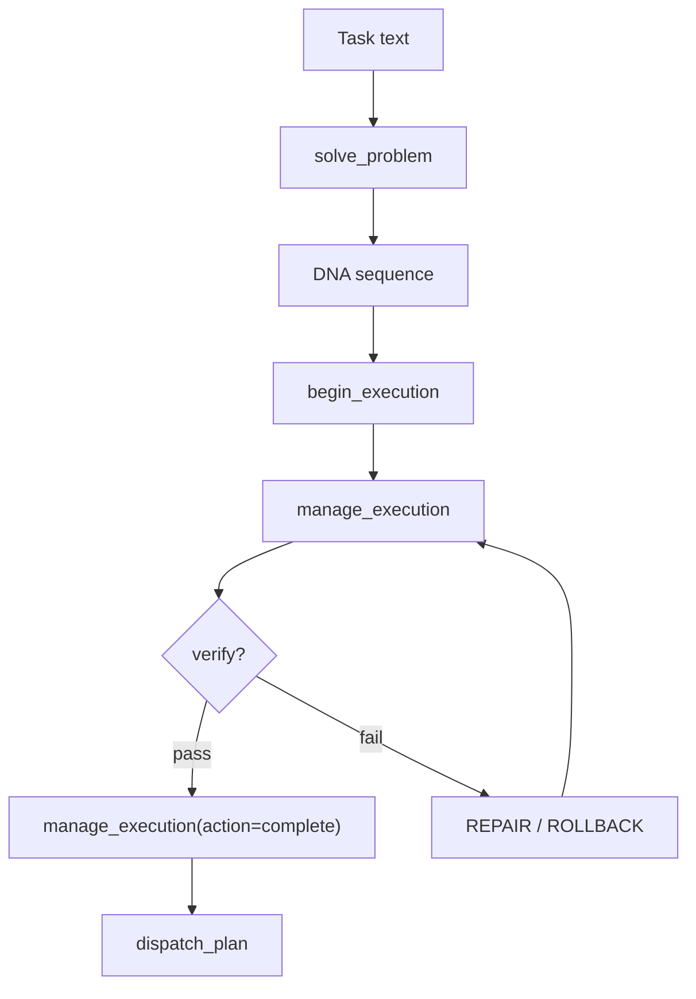

# Barricade Developer Guide

## What This Project Is

Barricade is a governed execution engine for AI-assisted code changes. It classifies a task, synthesizes DNA, runs a verifiable execution session, and only hands off a dispatch plan after checks pass.

Active docs live in [README.md](README.md), [docs/architecture.md](docs/architecture.md), [docs/api_reference.md](docs/api_reference.md), [docs/tests.md](docs/tests.md), and [docs/phases.md](docs/phases.md). Archived notes live in [docs/history.md](docs/history.md) and [docs/barricade_AB.md](docs/barricade_AB.md); they are not current guidance.

## How It Works



## Core Concepts

### DNA Tokens

The workflow mostly uses a small set of primary tokens:

| Token         | What It Does                   |
| ------------- | ------------------------------ |
| `OBSERVE`     | Read context and constraints   |
| `PLAN`        | Break the work into phases     |
| `WRITE_PLAN`  | Emit a plan artifact           |
| `WRITE_PATCH` | Emit a patch artifact          |
| `VERIFY`      | Run a verification step        |
| `SUMMARIZE`   | Record the outcome             |
| `REPAIR`      | Fix a failed verification path |
| `ROLLBACK`    | Undo a bad path                |

The full token vocabulary, including artifact ops and support tokens, is documented in [docs/api_reference.md](docs/api_reference.md).

### Macros

Macros are reusable sequences. `PATCH_LOOP = PLAN → REPAIR → VERIFY`. The engine expands macros recursively until it reaches primitive tokens.

### Artifact Market

Each step produces an artifact with score, price, and metadata. That market is how the executor tracks evidence, not just output text.

## MCP Tools

There are 8 public tools:

| Tool                      | Purpose                                             |
| ------------------------- | --------------------------------------------------- |
| `solve_problem`           | Classify a task and synthesize DNA                  |
| `begin_execution`         | Start an execution session                          |
| `manage_execution`        | Submit, verify, read, report, or complete a session |
| `dispatch_plan`           | Apply a governed file update set                    |
| `run_benchmark_task`      | Run the evolutionary benchmark                      |
| `analyze_scaling_profile` | Diagnose benchmark output                           |
| `describe_tools`          | List the public MCP surface                         |
| `inspect_state`           | Inspect learned state and recent runs               |

## Code Structure

```text
barricade/
├── executor/              execution sessions, artifacts, verification
├── feed_derived_dna/      DNA sequencing, scoring, controller, pipeline
├── workflow.py            task intake and routing
├── workflow_intake.py     task classification and shape profiling
├── problem_ir.py          problem intermediate representation
├── dispatch.py            governed file updates
├── mcp_server.py          MCP tool surface
├── runtime.py             benchmark runner
├── scaling.py             comparison and diagnostics
├── _shared.py             small shared helpers
├── _validation.py         input validation
├── _verification_parser.py structured verification parsing
└── _state_inspector.py    persistent state summary
```

## Testing

Run the suite with:

```bash
pytest tests -q
```

The current suite has 129 passing tests and 9 subtests. High-signal coverage lives in [docs/tests.md](docs/tests.md).
