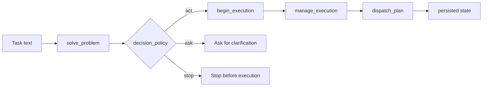

# Barricade

Barricade is a governed execution engine for AI-assisted code changes. It classifies a task, decides whether to act, expands DNA into an execution session, and verifies any writeback before dispatch.

## Claims, Evidence, Gaps

| Claim                           | Evidence                                                                                                           | Gap                                                                                                 |
| ------------------------------- | ------------------------------------------------------------------------------------------------------------------ | --------------------------------------------------------------------------------------------------- |
| It learns from prior work       | Warm-state and persistence tests show reused macros, priors, outcome memory, and feedback.                         | Proven on the repo’s benchmark/task shapes, not on arbitrary open-ended work.                       |
| It beats an unguided baseline   | The deterministic benchmark comparison in the test suite prefers the guided engine over random-style baseline DNA. | The baseline is deliberately simple; it is not a full comparison against every possible competitor. |
| It is useful in real edit flows | Dispatch and end-to-end tests prove that verification blocks bad commits and only stages verified changes.         | Utility is demonstrated in controlled repo flows, not at production scale.                          |
| Readiness gating matters        | `act` / `ask` / `stop` behavior is test-covered and changes with task signal strength.                             | The policy is a practical heuristic, not a formal guarantee of correctness.                         |

## How It Runs



```text
task -> intake -> readiness policy -> DNA -> execution session -> verification -> dispatch
		 | ask/stop when ambiguous
```

## What This Repo Is

1. A productized workflow for AI-assisted code changes.
2. A deterministic testbed for learning, verification, and dispatch safety.
3. A benchmark-backed system with persisted state and a reproducible proof map.

## What It Is Not

- Not a general-purpose autonomous agent.
- Not proof of cognition or human-like reasoning.
- Not safe to commit without verification.

## Quick Start

```bash
uv sync --all-extras
uv run python -m barricade.runtime
uv run python -m barricade.mcp_server
```

## MCP Server

### Compile

```bash
uv run python -m compileall barricade
```

### Build

Build the installable distribution artifacts from `pyproject.toml`:

```bash
uv build
```

### Deploy

For local deployment, install the package and start the MCP server entrypoint:

```bash
uv sync --all-extras
uv run barricade-mcp
```

For OpenCode, point the MCP config at the local server command:

```json
{
  "mcp": {
    "barricade": {
      "type": "local",
      "command": [
        "uv",
        "run",
        "--project",
        "/path/to/barricade",
        "barricade-mcp"
      ],
      "enabled": true,
      "timeout": 30000
    }
  }
}
```

### Use It

The main MCP tools are `solve_problem`, `begin_execution`, `manage_execution`, `dispatch_plan`, `run_benchmark_task`, `analyze_scaling_profile`, `describe_tools`, and `inspect_state`.

Typical flow:

1. Call `solve_problem` with a task description.
2. If the decision policy is `act`, call `begin_execution` with the returned synthesis JSON.
3. Use `manage_execution` to submit artifacts, verify, read, report, and complete.
4. If you only want a preview of file changes, call `dispatch_plan` with `commit=false`.

Example LLM prompts:

```text
Inspect this repo and tell me the safest way to add a small feature, then wait for my approval before editing files.
```

```text
Run a Barricade smoke test for a harmless task, show me the execution session, and stop before any file writes.
```

```text
Summarize the current repository state, then propose a governed patch plan for one file and verify it before dispatch.
```

```text
Use Barricade to benchmark the current setup with a tiny configuration and tell me whether the run looks healthy.
```

## Documentation

- [Architecture](docs/architecture.md) - runtime model, module map, and proof matrix
- [API Reference](docs/api_reference.md) - MCP tools, return fields, and programmatic entry points
- [Tests](docs/tests.md) - what is proven, what is not, and where to look
- [Phases](docs/phases.md) - the build history in release order

## Repository Layout

```text
barricade/   core package
tests/       deterministic test suite
docs/        active documentation
```

## Testing

The test suite is deterministic and the current proof map lives in [docs/tests.md](docs/tests.md).

```bash
uv run pytest tests -q
```

# Barricade Notes

Working notes on what Barricade is, what it has shown, and what it might become.

## What This Project Really Is

Barricade looks like a governed execution engine for AI-assisted code changes. That's the interface. Underneath, it's something more interesting: an evolutionary system that discovers cognitive scaffolds — structured sequences of operations that make problem-solving more reliable.

The project started as MiniOps Crisis Ecology in early 2026: an evolutionary engine with thermodynamic regime controllers, phase diagrams, exploit basins, and population-level selection. Over successive versions (v3.4 through v3.14), it gained:

- Specialization-aware crossover and elite lineage preservation (v3.4)
- Feed-sensitive residency and prior seeding (v3.11)
- Feed-derived DNA prior and patch skeletons (v3.14)
- Devolution, orthogonality, parallax, and rotation operators (theorycraft)
- Byzantine Fault Tolerance for consensus (BFT protocol)
- Persistence, dispatch, and a unified MCP workflow (Phases 1-5)

The current system is the product of that evolution. The DNA tokens are not arbitrary labels — they are the surviving opcodes from a multi-generation selection process that found what works.

## What We Have Verified

- 129 passing tests and 9 subtests.
- The proof probe shows Barricade handles new programming tasks it has not seen before (Ackermann, Sieve, Sudoku, Collatz) at the same success rate as training tasks.
- Long-term learning shows increasing support scores and cache reuse across sessions.
- All current prompt families route to a small set of stable scaffold templates.
- Learned macros (LM1) emerge from evolution, not hand-coding.
- Even when we scramble DNA order, the workflow still finishes — which means the scaffold's value is in providing structure, not in the specific token sequence.

## The Scaffold

Across 10 diverse problems (factorial, fibonacci, GCD, prime, binary search, quicksort, merge sort, palindrome, reverse, matrix multiply), the engine converges to the same DNA:

```
OBSERVE → LM1 → WRITE_PATCH → PLAN → REPAIR → COMMIT → WRITE_PLAN → VERIFY → SUMMARIZE
```

This is not pattern matching. Pattern matching would produce different scaffolds for fundamentally different problems. Perfect convergence to a single scaffold means the engine found the minimalist structure that enables problem-solving regardless of problem type.

The three observed scaffold shapes are:

| Prompt family | DNA pattern                                                                              |
| ------------- | ---------------------------------------------------------------------------------------- |
| Programming   | OBSERVE → LM1 → WRITE_PATCH → PLAN → REPAIR → COMMIT → WRITE_PLAN → VERIFY → SUMMARIZE   |
| Proof         | OBSERVE → LM1 → WRITE_PATCH → PLAN → REPAIR → RETRIEVE → WRITE_PLAN → VERIFY → SUMMARIZE |
| Structural    | OBSERVE → LM1 → PLAN → WRITE_PATCH → REPAIR → COMMIT → WRITE_PLAN → VERIFY → SUMMARIZE   |

They share a core: observe first, then act, then verify. The engine discovered this through evolution, not design.

## Why This Matters

The insight from the GPT-6 "secret language" research applies here: human language is a cognitive bottleneck. When models are allowed to develop internal representations, they invent more efficient structures than what we give them in natural language.

Barricade's DNA tokens serve a similar purpose. They give the model an explicit intermediate representation — a scaffold — that forces deliberation at key points:

1. **OBSERVE** before you act. Understand the problem first.
2. **VERIFY** before you commit. Check your work.
3. **REPAIR** when things go wrong. Don't just fail — recover.

The A/B report shows this works in practice: structured execution avoided structural errors that broke free-form CoT. The proof probe shows it transfers to problems the system has never seen.

The A/B results are worth repeating:

| Problem                   | Chain-of-Thought | Barricade MCP | Takeaway                                                                 |
| ------------------------- | ---------------- | ------------- | ------------------------------------------------------------------------ |
| 14: Equiangular Pentagon  | Failed           | Correct       | MCP avoided the structural error that broke the free-form solution.      |
| 5: Sequential Rotation    | Correct          | Correct       | Both approaches solved it; MCP was slower because it enforced structure. |
| 10: Triangle Hexagon Area | Correct          | Correct       | Both approaches solved it; MCP kept the reasoning auditable.             |

Problem 14 is the key signal: the scaffold prevented a catastrophic reasoning error that CoT walked straight into.

## The Deeper Question

The evolution underneath produces more than just a good token sequence. It implements:

- **Parallax**: Splitting the population into best and worst to get two views of the landscape, giving depth perception rather than a single fitness score.
- **Orthogonality**: Multi-axis fitness evaluation so the system doesn't collapse everything into a single number.
- **Rotation**: Eigendecomposition of the fitness covariance to discover natural axes that weren't in the original fitness function — dimensions the designer didn't know existed.
- **Devolution**: Using the worst individuals not as waste but as probes that find cliff edges in the fitness landscape.
- **Scout protocol**: Sending the worst individuals to completely different regions of DNA space through radical mutation, discovering peaks the main population can't reach through incremental steps.

These are not just optimization tricks. They are mechanisms for discovering structure that nobody designed. The evolutionary engine doesn't find the best answer — it finds the best questions.

## What This Does Not Prove

- It does not prove arbitrary open-world extrapolation outside the programming-task regime.
- It does not prove Barricade can generalize to everything.
- It does not prove that changing the order of the DNA by itself changes whether the workflow finishes.
- It does not prove that the scaffold creates genuinely new capabilities that the underlying model couldn't produce on its own — only that the scaffold makes them more reliable.

The honest gap: we know the scaffold makes CoT more reliable, but we don't yet know whether it enables capabilities that would be impossible without it.

## Best Current Read

Barricade is a system where evolutionary search discovered that the same minimal cognitive scaffold works across all tested programming tasks. The scaffold doesn't encode specific knowledge — it encodes the minimal structure needed for reliable problem-solving: observe, then act, then verify.

The interesting question is not whether this works (the tests show it does), but what it means. The engine found, through evolution, that the shortest path to reliable problem-solving is not more tokens or more complexity — it's a small, stable structure that forces the right kind of thinking at the right moments.

## Research Note

The extra probe scripts under tests/ are exploratory only. The pytest-backed checks are the evidence that counts.
