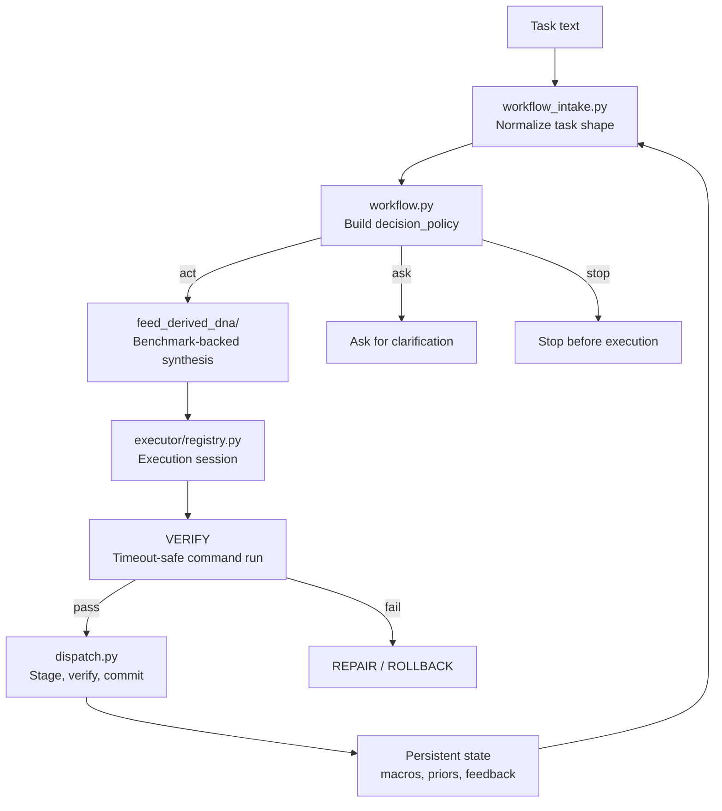
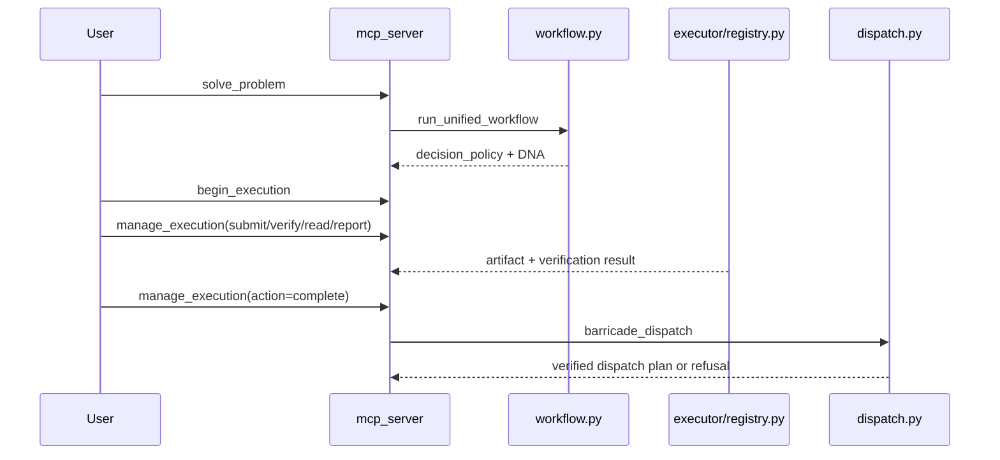

# Architecture

Barricade is a governed execution engine for AI-assisted code changes.
It turns task text into a readiness decision, a stepwise execution session, and a verified dispatch plan.

## At A Glance



```text
task text
   |
   v
workflow_intake -> readiness policy -> DNA synthesis -> execution session -> verification -> dispatch
      | ask/stop when ambiguous
```

## Runtime Contract

Barricade is not a free-form chat agent. It is a contract-driven execution system:

- `solve_problem` classifies the task and returns a structured decision policy.
- `begin_execution` expands DNA into a concrete session with step-by-step instructions.
- `manage_execution` records artifacts, runs verification, or completes the session.
- `dispatch_plan` stages file changes, verifies them in isolation, and only commits on success.

If the decision policy says `ask` or `stop`, execution is withheld until the task is clearer or safer.
Compatibility fallbacks are narrow and explicit; there is no hidden alternate execution path.

## Artifact Market

Barricade still uses a market, but it is an internal execution market rather than a trading system.
Each step emits an artifact into `session.market`, and the market is the evidence ledger for the run.

```text
submit / verify
      |
      v
  Artifact
      |
      v
session.market -> market snapshot -> completion summary
```

The market entry is a structured record with these fields:

| Field         | Meaning                                                               |
| ------------- | --------------------------------------------------------------------- |
| `artifact_id` | Stable identifier for the artifact inside the session.                |
| `token`       | The DNA token that produced it.                                       |
| `kind`        | Artifact family such as observation, patch, summary, or verification. |
| `content`     | The artifact body.                                                    |
| `creator`     | Usually `host` for the built-in executor path.                        |
| `epoch`       | The step index when the artifact was created.                         |
| `price`       | Derived from score and content complexity.                            |
| `score`       | Quality score used for ranking and summaries.                         |
| `status`      | `submitted`, `passed`, or `failed`.                                   |
| `metadata`    | Trace data, verification details, and scoring context.                |

How it behaves now:

1. `submit` stores the current step output as an artifact in the market.
2. `verify` stores a verification artifact and preserves the structured result.
3. `view_market` returns a sorted snapshot of the current market.
4. `complete_execution` ranks the artifacts and persists the best governed and best raw snapshot in the run summary.

The market is not decorative. It is how Barricade keeps step evidence, verification evidence, and completion evidence in one place.

## Module Map

| Component                                                           | Responsibility                                                                               |
| ------------------------------------------------------------------- | -------------------------------------------------------------------------------------------- |
| [barricade/workflow_intake.py](../barricade/workflow_intake.py)     | Parse task text into goal, constraints, deliverables, risks, domain tags, and shape profile. |
| [barricade/problem_ir.py](../barricade/problem_ir.py)               | Build structured problem intermediate representations from raw task text.                    |
| [barricade/workflow.py](../barricade/workflow.py)                   | Build the readiness policy and synthesis result returned by `solve_problem`.                 |
| [barricade/feed_derived_dna/](../barricade/feed_derived_dna/)       | Generate benchmark-backed DNA, mine reusable patterns, and persist learned state.            |
| [barricade/executor/registry.py](../barricade/executor/registry.py) | Run execution sessions, score artifacts, and advance the DNA cursor.                         |
| [barricade/dispatch.py](../barricade/dispatch.py)                   | Stage file updates, run verification in a clean copy, and commit only if checks pass.        |
| [barricade/\_shared.py](../barricade/_shared.py)                    | Share helpers, normalization, and timeout-safe subprocess execution.                         |
| [barricade/scaling.py](../barricade/scaling.py)                     | Compare benchmark runs and diagnose whether a candidate improved.                            |
| [barricade/mcp_server.py](../barricade/mcp_server.py)               | Expose the eight public tools over MCP.                                                      |
| [barricade/runtime.py](../barricade/runtime.py)                     | Run deterministic benchmark comparisons, compact summaries, and ablation studies.            |

## Benchmark Surface

The benchmark APIs now favor compact output. The full payload is still available, but it is opt-in so the default path stays readable in the editor and in MCP responses.

| Entry point                | Default behavior           | Full payload opt-in | Notes                                                                       |
| -------------------------- | -------------------------- | ------------------- | --------------------------------------------------------------------------- |
| `run_benchmark_task`       | Compact summary            | `compact=False`     | Best for interactive runs and tool output.                                  |
| `run_benchmark_comparison` | Compact comparison summary | `compact=False`     | Returns baseline/candidate summaries plus the comparison report by default. |
| `run_ablation_study`       | Compact ablation rows      | n/a                 | Compares the baseline against feature-flag removals.                        |

The current ablation modes are simple feature-flag removals:

| Ablation mode            | Disabled capability                      |
| ------------------------ | ---------------------------------------- |
| `no_parallax`            | Parallax probes and replication pressure |
| `no_orthogonality`       | Orthogonality selection pressure         |
| `no_rotation`            | Rotation-aware selection                 |
| `no_curriculum`          | Curriculum ordering                      |
| `no_primitive_contracts` | Primitive contract enforcement           |
| `minimal`                | All of the above                         |

## Claim / Evidence / Gap

The repo should claim only what the tests and benchmark comparisons actually support.

| Claim                                 | Evidence                                                                                                                                                                                                        | Gap                                                                                                |
| ------------------------------------- | --------------------------------------------------------------------------------------------------------------------------------------------------------------------------------------------------------------- | -------------------------------------------------------------------------------------------------- |
| The engine learns from prior work     | [tests/test_phase1_persistence.py](../tests/test_phase1_persistence.py), [tests/test_extreme_validation.py](../tests/test_extreme_validation.py)                                                                | Proven on warm-state benchmarks and repeat-task families, not on arbitrary open-world re-learning. |
| The engine beats an unguided baseline | [tests/test_barricade_runtime.py](../tests/test_barricade_runtime.py)                                                                                                                                           | The baseline is intentionally simple and unguided; it is not a universal competitor benchmark.     |
| The engine is useful in practice      | [tests/test_phase2_dispatch.py](../tests/test_phase2_dispatch.py), [tests/test_e2e_execution.py](../tests/test_e2e_execution.py), [tests/test_mcp_tool_descriptions.py](../tests/test_mcp_tool_descriptions.py) | Proven in controlled repository flows, not at production scale or across all repo shapes.          |
| The readiness gate changes behavior   | [tests/test_phase3_workflow.py](../tests/test_phase3_workflow.py), [tests/test_extreme_validation.py](../tests/test_extreme_validation.py)                                                                      | The gate is a heuristic policy, not a formal guarantee of success.                                 |

These are the product claims that should stay in the repo. Anything else is implementation detail.

## Execution Sequence



## State Model

```text
.barricade_state/
├── discoverables/
│   ├── macro_library.json
│   └── motif_cache.json
├── outcome_ledger.jsonl
├── runs.jsonl
├── lineages.jsonl
├── benchmark_runs/
└── task_shape_priors.jsonl
```

This is the product memory. When a `state_dir` is provided, later runs can reuse the stored macros, priors, and feedback.

## What The Code Does Not Claim

- It does not claim general intelligence or human-like cognition.
- It does not claim that verification can be skipped when the task looks easy.
- It does not claim production-scale reliability across every repository or every language.
- It does not claim that every compatibility fallback is useful; the only ones kept are explicit and test-covered.
